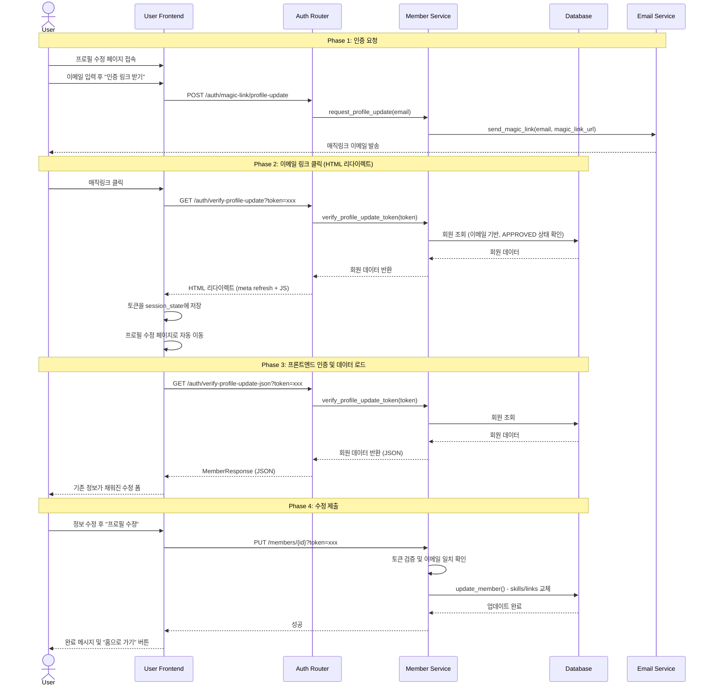

# 회원 정보 수정 시스템 시퀀스

## 사용자 프로필 수정 (확정)



---

## API 명세

### 1. POST /auth/magic-link/profile-update
프로필 수정용 매직링크 요청

**요청:**
```json
{
  "email": "user@example.com"
}
```

**응답 (200 OK):**
```json
{
  "message": "Magic link sent to your email"
}
```

**에러 응답:**
- `404 Not Found`: 가입되지 않은 이메일
  ```json
  {
    "detail": "Member not found"
  }
  ```

---

### 2. GET /auth/verify-profile-update?token={token}&redirect={url}
프로필 수정 토큰 검증 및 프론트엔드로 리다이렉트 (이메일 링크용)

**요청:**
- Query Parameter: 
  - `token` (string, required) - 매직링크 토큰
  - `redirect` (string, optional) - 리다이렉트할 프론트엔드 URL (기본값: `http://localhost:8501`)

**응답 (200 OK):**
- Content-Type: `text/html`
- HTMLResponse with meta refresh and JavaScript redirect

```html
<!DOCTYPE html>
<html>
<head>
    <meta http-equiv="refresh" content="0;url=http://localhost:8501?token=xxx">
    <script>
        window.location.href = "http://localhost:8501?token=xxx";
    </script>
</head>
<body>
    <p>Redirecting to profile update page...</p>
    <p>If not redirected, <a href="http://localhost:8501?token=xxx">click here</a>.</p>
</body>
</html>
```

**에러 응답:**
- `401 Unauthorized`: 토큰 만료 또는 조작
  - HTMLResponse with error page
- `403 Forbidden`: 회원 상태가 APPROVED가 아님
  - HTMLResponse with error page (status code 403)
- `404 Not Found`: 회원 정보 없음
  - HTMLResponse with error page (status code 404)

---

### 3. GET /auth/verify-profile-update-json?token={token}
프로필 수정 토큰 검증 및 회원 정보 반환 (프론트엔드 API용)

**요청:**
- Query Parameter: `token` (string, required) - 매직링크 토큰

**응답 (200 OK):**
```json
{
  "id": 1,
  "email": "user@example.com",
  "name": "홍길동",
  "generation": 1,
  "rank": "정회원",
  "description": "안녕하세요",
  "image_url": "https://example.com/image.jpg",
  "status": "APPROVED",
  "created_at": "2026-01-01T00:00:00Z",
  "updated_at": "2026-01-01T00:00:00Z",
  "skills": [
    {"id": 1, "skill_name": "Python"},
    {"id": 2, "skill_name": "React"}
  ],
  "links": [
    {"id": 1, "link_type": "github", "url": "https://github.com/user"}
  ]
}
```

**에러 응답:**
- `401 Unauthorized`: 토큰 만료 또는 조작
  ```json
  {
    "detail": "Invalid or expired token"
  }
  ```
- `403 Forbidden`: 회원 상태가 APPROVED가 아님
  ```json
  {
    "detail": "Only approved members can update profiles. Current status: PENDING"
  }
  ```
- `404 Not Found`: 회원 정보 없음
  ```json
  {
    "detail": "Member not found"
  }
  ```

---

### 4. PUT /members/{member_id}?token={token}
회원 프로필 수정

**요청:**
- Path Parameter: `member_id` (integer, required)
- Query Parameter: `token` (string, required) - 매직링크 토큰

**요청 본문:**
```json
{
  "name": "홍길동",
  "description": "업데이트된 자기소개",
  "image_url": "https://example.com/new-image.jpg",
  "skills": [
    {"skill_name": "Python"},
    {"skill_name": "TypeScript"},
    {"skill_name": "Docker"}
  ],
  "links": [
    {"link_type": "github", "url": "https://github.com/user"},
    {"link_type": "linkedin", "url": "https://linkedin.com/in/user"}
  ]
}
```

**응답 (200 OK):**
```json
{
  "id": 1,
  "email": "user@example.com",
  "name": "홍길동",
  "generation": 1,
  "rank": "정회원",
  "description": "업데이트된 자기소개",
  "image_url": "https://example.com/new-image.jpg",
  "status": "APPROVED",
  "created_at": "2026-01-01T00:00:00Z",
  "updated_at": "2026-01-09T12:34:56Z",
  "skills": [
    {"id": 1, "skill_name": "Python"},
    {"id": 3, "skill_name": "TypeScript"},
    {"id": 4, "skill_name": "Docker"}
  ],
  "links": [
    {"id": 1, "link_type": "github", "url": "https://github.com/user"},
    {"id": 2, "link_type": "linkedin", "url": "https://linkedin.com/in/user"}
  ]
}
```

**에러 응답:**
- `401 Unauthorized`: 토큰 만료 또는 조작
  ```json
  {
    "detail": "Invalid or expired token"
  }
  ```
- `403 Forbidden`: 토큰 이메일과 회원 ID 불일치
  ```json
  {
    "detail": "Unauthorized: Token does not match this member. You can only update your own profile."
  }
  ```
- `404 Not Found`: 회원 정보 없음
  ```json
  {
    "detail": "Member not found"
  }
  ```
- `400 Bad Request`: 데이터 유효성 검증 실패
  ```json
  {
    "detail": "Validation error: ..."
  }
  ```

---

## 에러 처리

### 에러 시나리오 및 처리 방식

#### 1. 토큰 관련 에러

##### 토큰 만료
- **상황**: 30분 유효기간 경과
- **응답**: `401 Unauthorized`
- **사용자 조치**: 인증 링크를 다시 요청
- **프론트엔드 처리**: "인증 토큰이 만료되었습니다. 다시 인증 링크를 요청해주세요." 메시지 표시

##### 토큰 조작
- **상황**: 토큰이 변조되거나 손상됨
- **응답**: `401 Unauthorized`
- **사용자 조치**: 인증 링크를 다시 요청
- **프론트엔드 처리**: "인증에 실패했습니다. 다시 시도해주세요." 메시지 표시

##### 토큰 목적 불일치
- **상황**: registration 토큰으로 프로필 수정 시도
- **응답**: `401 Unauthorized`
- **프론트엔드 처리**: "잘못된 인증 링크입니다." 메시지 표시

#### 2. 인증 관련 에러

##### 이메일 불일치
- **상황**: 토큰의 이메일과 수정하려는 회원의 이메일이 다름
- **응답**: `403 Forbidden`
- **사용자 조치**: 본인 계정으로만 수정 가능
- **프론트엔드 처리**: "본인의 프로필만 수정할 수 있습니다." 메시지 표시

##### 회원 상태가 APPROVED가 아님
- **상황**: UNVERIFIED 또는 PENDING 상태의 회원이 수정 시도
- **응답**: `403 Forbidden`
- **사용자 조치**: 관리자 승인 대기 또는 관리자 문의
- **프론트엔드 처리**: "승인된 회원만 프로필을 수정할 수 있습니다." 메시지 표시

#### 3. 데이터 유효성 검증 에러

##### 필수 필드 누락
- **상황**: name 필드 없음
- **응답**: `400 Bad Request`
- **프론트엔드 처리**: "이름을 입력해주세요." 메시지 표시

##### 스킬/링크 과다
- **상황**: 스킬 항목이 제한을 초과 (예: 50개 이상)
- **응답**: `400 Bad Request`
- **프론트엔드 처리**: "기술 스택은 50개 이하로 입력해주세요." 메시지 표시

##### 잘못된 데이터 형식
- **상황**: 잘못된 URL, 너무 긴 텍스트 등
- **응답**: `400 Bad Request`
- **프론트엔드 처리**: 구체적인 에러 메시지 표시

#### 4. 데이터베이스 에러

##### 데이터베이스 연결 실패
- **응답**: `500 Internal Server Error`
- **사용자 조치**: 잠시 후 다시 시도
- **프론트엔드 처리**: "서버 오류가 발생했습니다. 잠시 후 다시 시도해주세요." 메시지 표시

##### 데이터베이스 제약 조건 위반
- **상황**: UNIQUE 제약 위반 등
- **응답**: `500 Internal Server Error`
- **프론트엔드 처리**: "저장 중 오류가 발생했습니다." 메시지 표시

---

## 비고

### 사용자 수정 제한 항목
- **email**: 변경 불가
- **generation**: 변경 불가
- **rank**: 변경 불가

### 기술 스택/링크 수정 방식
- **완전 교체**: 새 리스트로 기존 데이터 전체 교체

### 보안 장치
1. **토큰 기반 인증**: 30분 유효기간
2. **이메일 검증**: 토큰 이메일 == 회원 이메일 확인
3. **상태 검증**: APPROVED 회원만 수정 가능
4. **목적 기반 검증**: `purpose="profile_update"` 토큰만 사용 가능

### 구현 세부사항

#### 이중 엔드포인트 구조
- **`/auth/verify-profile-update`**: 이메일 링크용 HTML 리다이렉트
  - 이메일 클라이언트 호환성 최적화
  - meta refresh + JavaScript 이중 리다이렉트
  
- **`/auth/verify-profile-update-json`**: 프론트엔드 API용 JSON 응답
  - Streamlit에서 직접 호출
  - MemberResponse JSON 반환

#### Streamlit 페이지 전환
1. 이메일 링크: `http://localhost:8501?token=xxx`
2. `app.py`에서 토큰 감지 → `st.session_state.profile_token`에 저장
3. `st.switch_page("pages/02_프로필_수정.py")`로 자동 이동
4. 프로필 수정 페이지에서 session_state에서 토큰 읽기
5. `/auth/verify-profile-update-json` 호출로 자동 인증

#### Form 제약사항 해결
- `st.form()` 안에서 `st.button()` 사용 불가
- 해결: 성공 상태를 `session_state.profile_update_success`에 저장
- Form 밖에서 성공 메시지와 "홈으로 가기" 버튼 표시

### 환경별 설정

#### 개발 환경
- **이메일 Provider**: Mock
- **동작**: 로그에 매직 링크 URL만 출력
- **테스트 방법**: 터미널 로그에서 URL 복사

#### 프로덕션 환경 (향후)
- **이메일 Provider**: Resend
- **필요 환경변수**:
  ```
  EMAIL_PROVIDER=resend
  RESEND_API_KEY=your-api-key
  EMAIL_FROM=Jaram <team@jaram.net>
  ```
- **리다이렉트 URL**: 프로덕션 도메인으로 변경 필요
