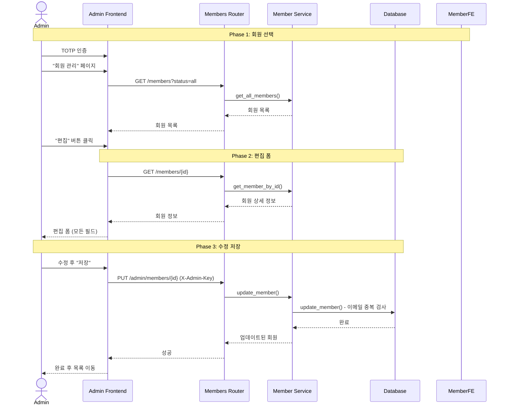

# 회원 정보 수정 시스템 시퀀스

## 사용자 프로필 수정 (확정)

---

## 관리자 프로필 수정 (보류)

> **참고:** 관리자 프로필 수정 기능은 현재 단계에서 구현하지 않고 다음 단계로 보류합니다.

---

## 비고

### 사용자 수정 제한 항목
- **email**: 변경 불가
- **generation**: 변경 불가
- **rank**: 변경 불가 (관리자만 수정 가능)

### 관리자 수정 가능 항목
- 모든 항목 수정 가능 (email, generation, rank 포함)

### 기술 스택/링크 수정 방식
- **완전 교체**: 새 리스트로 기존 데이터 전체 교체

### 보안 장치
1. **토큰 기반 인증**: 30분 유효기간
2. **이메일 검증**: 토큰 이메일 == 회원 이메일 확인
3. **상태 검증**: APPROVED 회원만 수정 가능
4. **관리자 인증**: TOTP + X-Admin-Key
