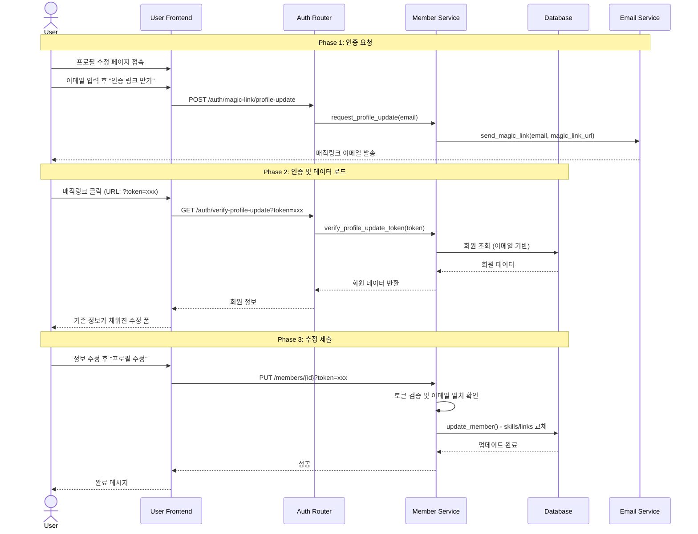
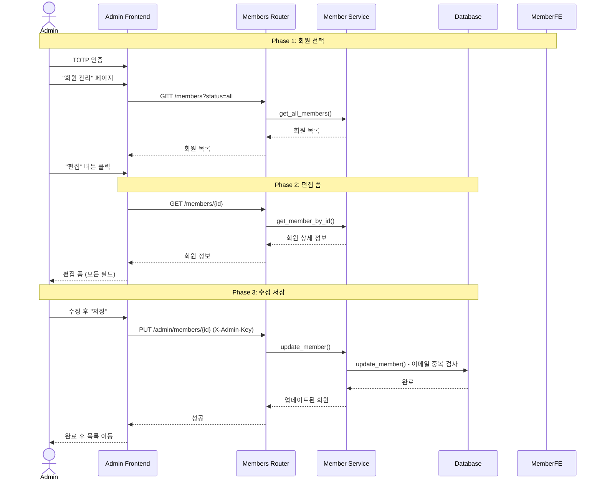

# 회원 정보 수정 기능 논의 노트
**날짜:** 2026-01-09

## 논의 내용

### 1. 수정 가능 항목

**사용자 수정 가능:**
- name, description, skills, links, image_url

**사용자 수정 불가 (read-only 표시):**
- email (이메일)
- generation (기수)
- rank (직급)

**관리자 수정 가능:**
- 모든 항목 (email, generation, rank 포함)

### 2. 인증 방식

매직링크 기반 인증:
1. 사용자가 "프로필 수정" 페이지 접속
2. 이메일 입력 후 "인증 링크 받기" 클릭
3. 이메일로 매직링크 발송 (URL: `?token=xxx`)
4. 링크 클릭 시 기존 정보가 채워진 수정 폼 표시
5. 수정 후 제출

**보안:**
- 토큰 유효기간: 30분
- 토큰 purpose: "profile_update"
- 토큰 이메일과 회원 이메일 일치 검증
- APPROVED 상태의 회원만 수정 가능

### 3. Skills/Links 수정 방식

새 리스트로 완전 교체 (전체 삭제 후 재삽입)

### 4. 관리자 기능

- 별도 관리자 페이지에서 회원 편집
- 기존 TOTP + X-Admin-Key 인증 활용
- 모든 필드 수정 가능

**상태:** 현재 단계에서는 구현하지 않음 (다음 단계로 보류)

---

## System Sequence Diagram

### 사용자 프로필 수정 (확정)

### 관리자 프로필 수정 (보류)

> **참고:** 관리자 프로필 수정 기능은 현재 단계에서 구현하지 않고 다음 단계로 보류합니다.

---

## 주요 API 엔드포인트

### 신규 추가
- `GET /auth/verify-profile-update?token=xxx`
- `PUT /admin/members/{id}`

### 기존 활성화
- `PUT /members/{id}?token=xxx` (현재 501 NOT_IMPLEMENTED)
