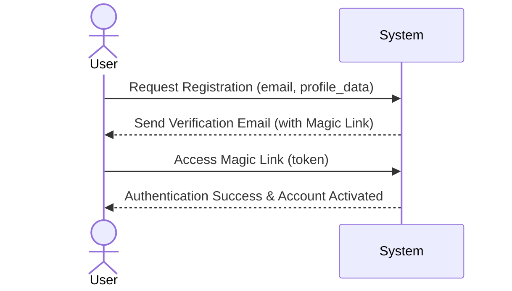
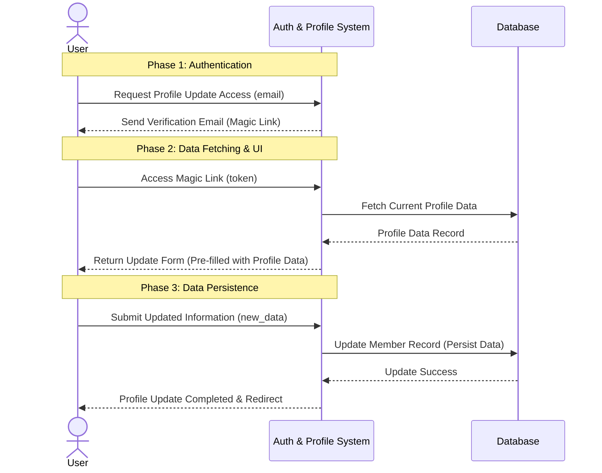
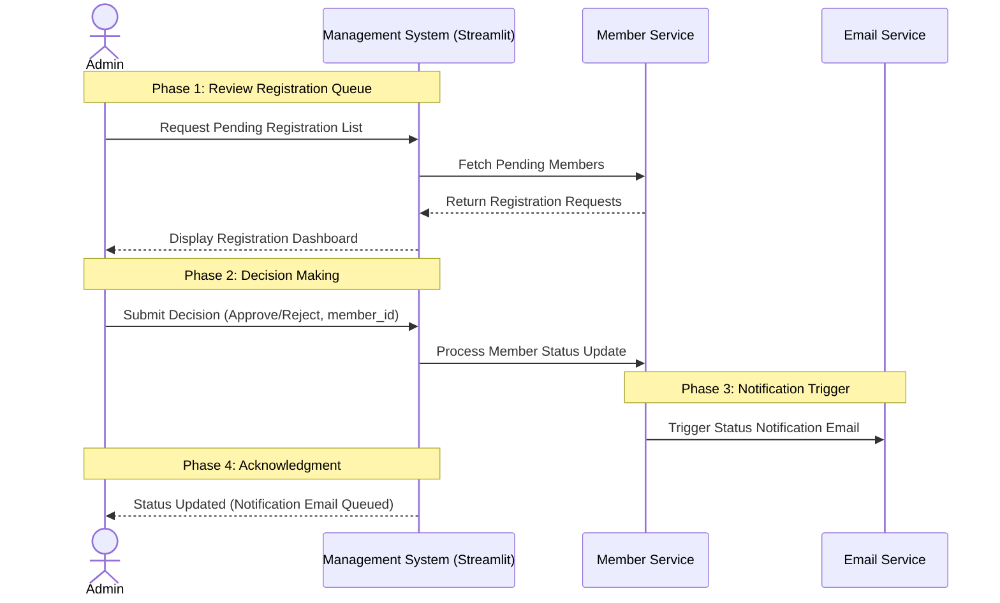

# 251220-project-specification-meeting-notes

## 요약

홈페이지 작업하기 위한 초기 미팅을 진행하였습니다.

(추가)


## 논의 사항

1. 이메일
2. 백엔드
3. 프론트
4. 관리 대시보드


## 회의 진행

### 1. 이메일

PoC 완료 상태임. 두 가지로 발송 가능함.

1. SMTP 통해서 메일 발송
2. API 통해서 메일 발송

SMTP의 경우 password 관련 보안 이슈가 있음. 따라서 약간의 시간이 걸리더라도 2번으로 진행.

### 2. 백엔드

회원 정보 관리 목적임. 

DB: SQLite - 사용자 정보 및 사진 URL 등 저장

Storage: MinIO - 프로필 사진 저장 및 URL 제공(리얼배포에서는 Cloudflare R2 이용)

1. User에 대한 CRUD
2. 이메일 발송
3. 매직링크 생성 (with JWT)

#### System Sequence Diagram: 회원가입



#### System Sequence Diagram: 제거

회원가입과 동일한 로직을 가지므로 스킵함.

#### Sequence Diagram: 정보 수정



### 3. 프론트

구체적으로 어떤 데이터가 필요한지 논의함.

* name
* 기수
* Rank(정회원, OB, 준OB 등) -> radio btn으로 제공
* 스킬
* Description
* links(github/linkedin/blog/instagram/notion/solved.ac) -> 폼에서 전체 보여주고, 입력한 것만 뜨도록 처리
* 이미지url
* 이메일

### 4. 대시보드

* 관리자가 멤버의 생성에 대해, 승인 및 거절 처리하기 위함.
* streamlit으로 작업

* 관리자가 승인/거절 시, 멤버에게 승인/거절에 대한 결과를 받아볼 수 있도록 메일 발송




## 백엔드 개발 순서

디테일한 것은 변경될 수 있음.

1. 배포 서버 확보
2. object storage, db(postgresql) 등 구축

3. table 정의
4. service 개발 - email/db/object_storage/magic_link
5. controller 개발

## 디렉토리 정의
```
project/
├── main.py                      # FastAPI 앱 진입점
├── database.py                  # DB 연결 설정
├── config.py                    # 환경변수, 설정
│
├── models/                      # ORM 모델
│   ├── __init__.py
│   ├── member.py
│   ├── skill.py
│   └── link.py
│
├── schemas/                     # Pydantic 스키마
│   ├── __init__.py
│   └── member.py               # 요청/응답 스키마
│
├── repositories/                # DB 쿼리
│   ├── __init__.py
│   └── member_repository.py
│
├── services/                    # 비즈니스 로직
│   ├── __init__.py
│   ├── member_service.py       # 회원 CRUD 로직
│   └── email_service.py        # 이메일 발송
│
├── routers/                     # API 엔드포인트
│   ├── __init__.py
│   ├── members.py              # 회원 조회 API
│   └── auth.py                 # 매직링크 관련 API
│
└── utils/                       # 유틸리티
    ├── __init__.py
    ├── token.py                # 매직링크 토큰 생성/검증
    └── email.py                # 이메일 템플릿
```
